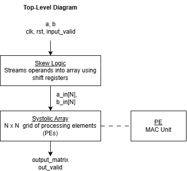
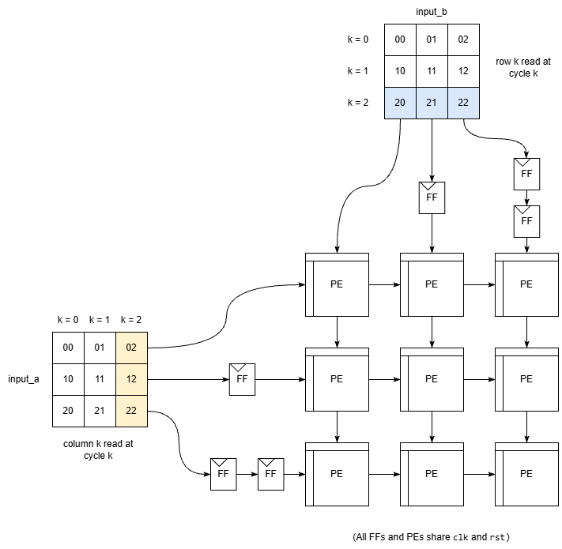

An output-stationary systolic array for N×N matrix multiplication (C = A × B)
(RTL and verification in progress)

## Top-level architecture

The array is an N×N grid of processing elements (PEs), each with a multiply-accumulate (MAC) unit. Each PE is responsible for exactly one output element. Operands flow through the grid (A moves right, B moves down) and each partial sum stays in place, which is what "output-stationary" means. The design is parametrized by N, so matrices of different sizes can be supported without rewriting the grid.

## Skew logic

PE(i,j) needs A[i][k] and B[k][j] to arrive on the same cycle, but the two values travel different distances to get there. To fix this, each row of A and each column of B passes through a shift-register delay chain: row i and column j are delayed by i and j cycles. Both operands then reach PE(i,j) after i + j cycles, so PE(i,j) works on `k = cycle - i - j`.

Since the array doesn't need the whole matrix up front, I decided to use a shift-register delay approach inistead of pre-built matrices.

